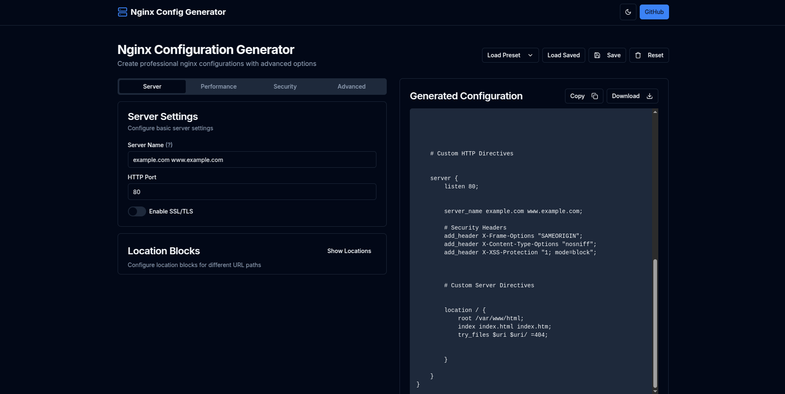

```markdown
# Nginx Configuration Generator

A user-friendly tool built with **Next.js** for automatically generating Nginx configuration files based on user input. This project simplifies the process of configuring Nginx for various use cases like reverse proxies, static file serving, SSL/TLS setups, and more.

## Features

- **Dynamic Configuration**: Automatically generates Nginx configuration blocks based on user inputs.
- **SSL/TLS Support**: Easily configure secure HTTPS connections with SSL certificates.
- **Multi-Domain Support**: Manage multiple domains or subdomains with custom configurations.
- **Customizable Templates**: Modify and extend Nginx configuration templates to fit your needs.
- **Responsive UI**: A clean and intuitive web interface powered by React and Next.js.

## Tech Stack

- **Next.js**: For server-side rendering and building the React-based user interface.
- **React**: UI components and state management.
- **Node.js**: Handles server-side processes and config generation.
- **Styled Components**: For styling the application.
- **Express.js** (optional): Used to handle backend logic for generating configurations.

## Installation

### Prerequisites

- **Node.js** (v20 or higher)
- **npm** or **yarn** (for managing dependencies)

### Steps to Install

1. **Clone the Repository**:

   ```bash
   git clone https://github.com/amoltribhuwan05/nginx-config-generator.git
   cd nginx-config-generator
   ```

2. **Install Dependencies**:

   Run the following command to install the required dependencies:

   ```bash
   npm install
   ```

   Or, if you prefer using yarn:

   ```bash
   yarn install
   ```

3. **Run the Application**:

   To start the development server, run:

   ```bash
   npm run dev
   ```

   Or, if using yarn:

   ```bash
   yarn dev
   ```

   Once the application is running, it will be available at `http://localhost:3000`.

## Usage

### Web Interface

1. Open your browser and navigate to `http://localhost:3000` to access the web-based UI.
2. Fill out the form with details about your server:
   - **Domain Name** (e.g., `example.com`)
   - **SSL Certificate Paths** (optional)
   - **Server Type** (reverse proxy, static files, etc.)
3. Click on **Generate Configuration** to create your Nginx configuration file.
4. Download or view the generated `nginx.conf` file.

### Example Configuration

Here’s an example of a basic Nginx configuration generated by the tool for a reverse proxy setup:

```nginx
server {
    listen 80;
    server_name example.com www.example.com;

    location / {
        proxy_pass http://localhost:3000;
        proxy_set_header Host $host;
        proxy_set_header X-Real-IP $remote_addr;
        proxy_set_header X-Forwarded-For $proxy_add_x_forwarded_for;
        proxy_set_header X-Forwarded-Proto $scheme;
    }
}

server {
    listen 443 ssl;
    server_name example.com www.example.com;

    ssl_certificate /etc/nginx/ssl/example.com.crt;
    ssl_certificate_key /etc/nginx/ssl/example.com.key;

    location / {
        proxy_pass http://localhost:3000;
        proxy_set_header Host $host;
        proxy_set_header X-Real-IP $remote_addr;
        proxy_set_header X-Forwarded-For $proxy_add_x_forwarded_for;
        proxy_set_header X-Forwarded-Proto $scheme;
    }
}
```

## Customization

You can modify the configuration templates located in the `templates/` directory to suit your specific needs. 

### Modify Templates

To adjust the generated configuration, simply update the template files in the `templates/` folder. For example, to change SSL settings, modify `templates/ssl.conf.template`.

## Contributing

We welcome contributions to improve the project! If you have suggestions or fixes, feel free to fork the repository and create a pull request.

### How to Contribute

1. Fork the repository.
2. Create a new branch (`git checkout -b feature-branch`).
3. Make your changes.
4. Commit your changes (`git commit -am 'Add feature'`).
5. Push to your fork (`git push origin feature-branch`).
6. Create a pull request.

## Highlights


---
Made with ❤️ by [Amol](https://github.com/amoltribhuwan05).